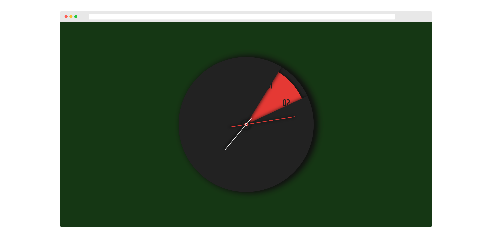

# Yet another Hex color clock

<i>A digitally represented clock (HH:MM:SS) serves as a valid hex color code.</i>

Every second is displayed as a different colour. Starting from black at midnight and
steadily shifting to white over the course of each day, as hours, minutes and seconds are
mapped across the hexadecimal colour system.

 

<i>Loved the project? Please visit <a href="time.manishyadav.dev">Website</a></i>

 

  

